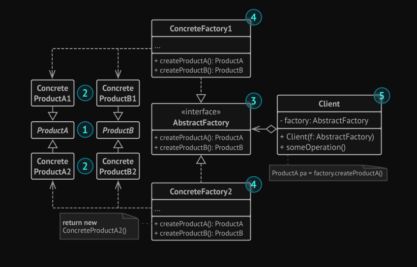
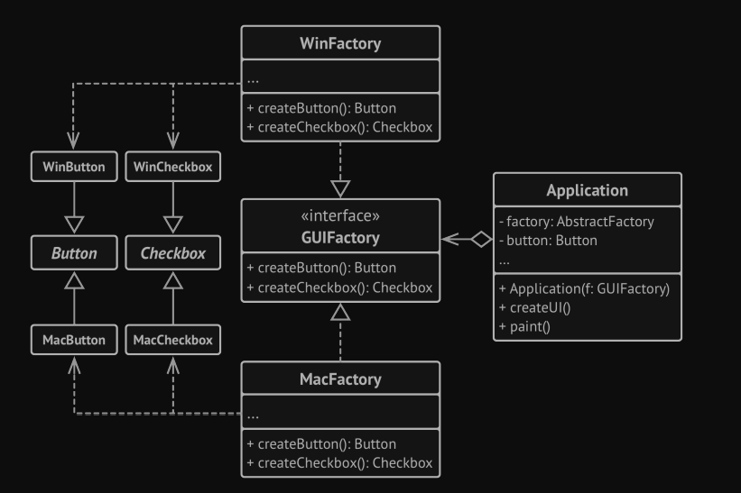

# Abstract Factory
Is a creational design pattern that lets you produce families of related objects without specifying their concrete classes.

### use Cases:

1. Use the Abstract Factory when your code needs to work with
   various families of related products, but you don’t want it to
   depend on the concrete classes of those products—they might
   be unknown beforehand or you simply want to allow for future
   extensibility.
2. In a well-designed program each class is responsible only for
   one thing. When a class deals with multiple product types,
   it may be worth extracting its factory methods into a standalone factory class or a full-blown Abstract Factory implementation.

### The Structure

### The problem:
Imagine that you have a cross-platform application, and you have some UI elements you want show
the user depend on his operating system.  

The Abstract Factory interface declares a set of creation methods
that the client code can use to produce different types of UI elements depending on his OS. 

