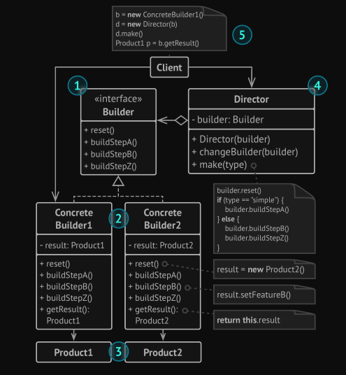
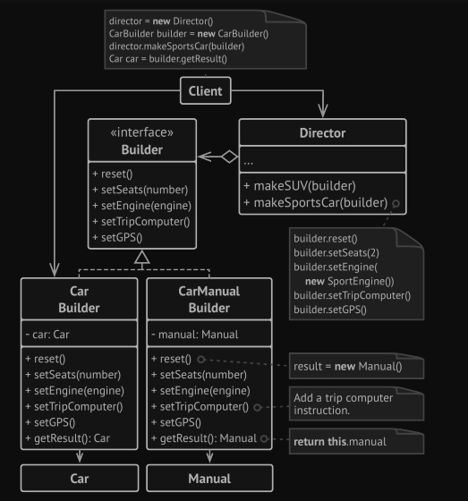

# Builder pattern:

A builder pattern encapsulates or hides the process of building a complex
object and separates the representation of the object and its construction. The
separation allows us to construct different representations using the same
construction process.

The Builder pattern lets you construct complex objects step by step.

### use Cases:

### The Structure

### The problem:

A car is a complex object that can be constructed in a hundred
different ways. Instead of bloating the Car class with a huge
constructor, we extracted the car assembly code into a separate 
car builder class. This class has a set of methods for configuring various parts of a car.

