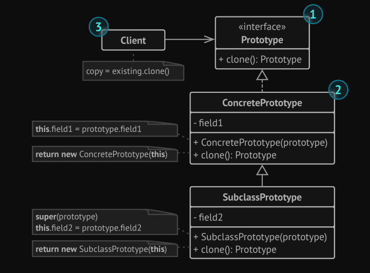
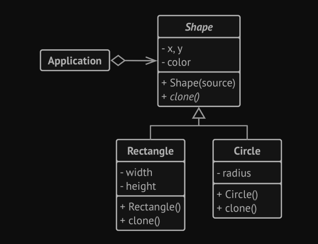

# Prototype (aka Clone)
Prototype is a creational design pattern that lets you copy existing objects without making your code
depending on their classes.

The pattern declares a common interface for all objects that support cloning. This
interface lets you clone an object without coupling your code to the class of that object.
Usually, such an interface contains just a single clone method.

## the structure

## the problem

