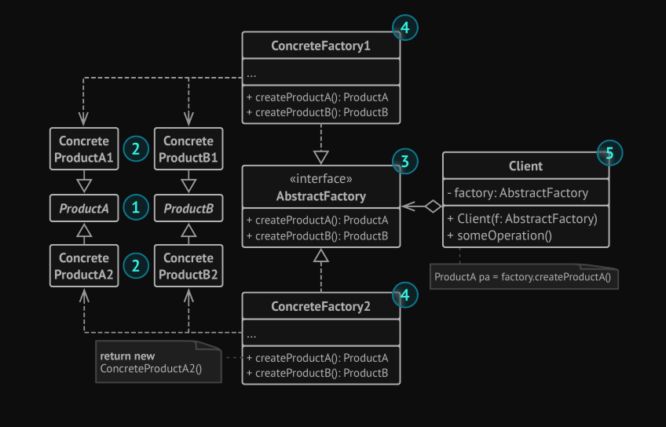
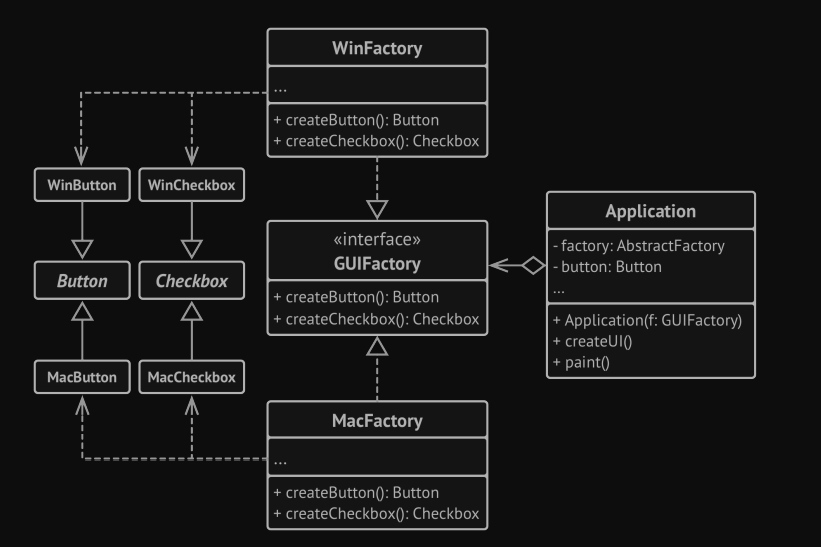

# Abstract Factory
Is a creational design pattern that lets you produce families of related objects without specifying their concrete classes.

### The problem:
Imagine that you have a cross-platform application, and you have some UI elements you want show
the user depend on his operating system.  

The Abstract Factory interface declares a set of creation methods
that the client code can use to produce different types of UI elements depending on his OS. 

